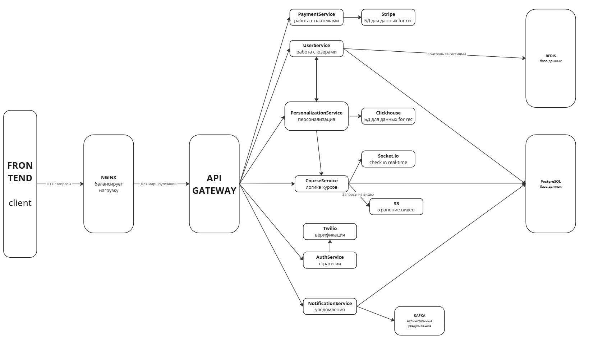

# Learnify - Personalized Learning Engine

## 1. Project Overview
The Personalized Learning Engine is a state-of-the-art educational platform designed to provide personalized learning experiences. The system tailors the course material to individual learners, identifying their weak spots and adapting the content to help them improve in areas where they need the most help. This project leverages modern technologies like microservices, Redis, Kafka, Kubernetes, and machine learning models to create a scalable, highly efficient, and intelligent learning environment.

## 2. Features
- **Personalized course generation**: The engine adapts the course based on each student's progress, focusing on areas they struggle with the most.
- **Microservices architecture**: The application is divided into multiple microservices, each responsible for a specific feature, ensuring scalability and flexibility.
- **Real-time performance tracking**: The system tracks student performance in real-time, adjusting the content and delivery dynamically.
- **Redis & Kafka**: Redis is used for caching to speed up responses, while Kafka ensures reliable data communication between microservices.
- **Kubernetes**: The platform is containerized using Kubernetes for easy scaling and management of services.
- **Machine learning model**: A machine learning model analyzes student behavior and learning patterns to suggest personalized content and study paths.
- **Nest.js & Nx**: The backend is built using Nest.js with Nx used for managing a monorepo architecture, allowing for efficient development of both backend and frontend services.
- **PostgreSQL**: The system relies on PostgreSQL for reliable data storage, using Prisma as an ORM for data management.

## 3. Technologies and Tools
- **Backend**: 
  - Nest.js (for building server-side logic)
  - Nx (for managing a monorepository structure)
  - Redis (for caching)
  - Kafka (for messaging and event-driven communication)
  - Kubernetes (for container orchestration and scaling)
  - PostgreSQL (for relational data storage)
- **Machine Learning**: Custom ML models for content personalization and performance tracking.
- **Microservices**: Each functionality is isolated into microservices, ensuring a scalable and maintainable architecture.

